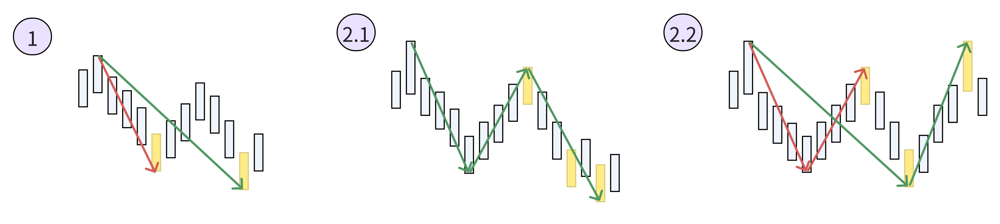

## k线合并

k线合并是为了将走势中两根K线之间的关系简化成“向上”和“向下”两个类别而提出的一种处理方法。
合并至少需要3根，前两根确定方向，后两根根据需要进行合并。

左包含和右包含处理方式都相同。

上涨方向，高点取最高，低点也取最高。

下跌方向，高点取最低，低点也取最低。

2个事项：

- 只有确认的k线才能参与合并处理，这就意味着只有在新k线诞生的那一刻，才能对前一根k线进行合并处理。
- 为了确认方向，从左往右一直找到两根不包含的k线才能开始进行合并分析，但是本程序中如果最开始的几根K线存在包含关系，则采用高点取最高、低点取最低的方式进行处理。

## 分型

为了找到k线序列中最原始的高低点。
在经过合并处理的k线序列中，两k线之间的关系只有上或下，那么三个k线之间的关系就可以分为：上上、下下、上下、下上这四种，即原文所指：上升k线、下降k线、顶分型和底分型四种。

## 笔

定义: 笔的2端必须一个是顶另一个是底，顶底之间必须有一根经过合并处理的k线，也就是说从顶到底或者从底到顶至少需要5根k线才可以构成一笔。。

满足笔的定义不一定能把笔确定出来，因为笔会生长。

顶是高度是大于底的。

下降笔的笔尾一定是整笔的最低值，上升笔的笔尾一定是整笔的最高值。

新笔根据定义能画出，则上一笔就可以确认。

下面3张特殊笔需要仔细体会。

【1图】笔会顺势进行延伸

【2.1图】同1图类似，也是笔的顺势延伸

【2.2图】笔无法顺势延伸，却往相反的方向进行发展，则需要进行笔的纠正

